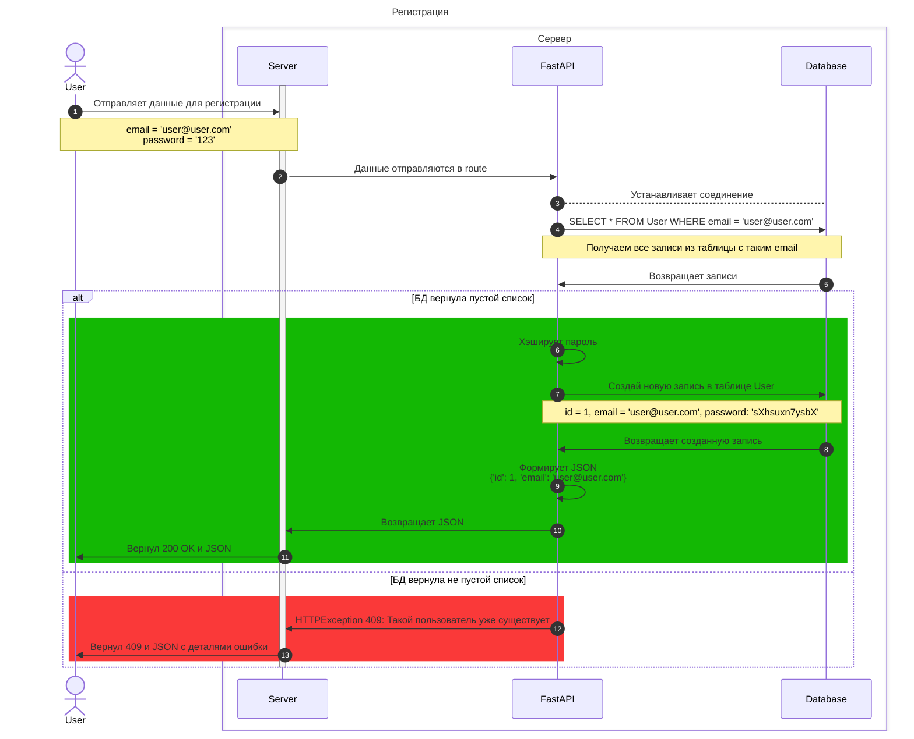

# Приложение Soyamate (REST API)
## Описание
**Soyamate** - это приложение для людей, которые хотят найти тиммейтов для сетевых видеоигр. Данный репозиторий представляет собой веб-приложение для коммуникации с клиентскими приложениями на устройствах под управлением iOS.

## Основные требования
В приложении должны быть реализованы следующие функции:
- Регистрация пользователя: пользователь может зарегистрироваться в приложении.
- Авторизация пользователя: пользователь может авторизоваться в приложении.
- Восстановление аккаунта: возможность восстановить доступ к аккаунту в случае, если пользователь забыл пароль или логин.
- Ролевая система: возможность создания пользователей с разными правами доступа и возможностями: администратор, модератор, гость, обычный пользователь.
- Заполнение и редактирование профиля: пользователь может редактировать свои данные.
- Поиск тиммейтов: выдача списка тиммейтов от наиболее к менее подходящим путем ранжирования по рейтингу, выбранным играм, жанрам и т.д.
- Мессенджер: пользователь может общаться как с одним человеком тет-а-тет, так и с группой людей (как беседы в ВК).

## Технические требования
- Язык программирования: ``Python 3.12+``
- Веб-фреймворк: ``FastAPI``
- ORM: ``SQLAlchemy``
- ORM Driver: ``asyncpg``
- СУБД: ``PostgreSQL 14``

## Архитектура приложения
описание основных модулей и компонентов; схема базы данных.

- **Модуль регистрации/аутентификации**:

    - **Регистрация**:

      Пользователь отправляет данные для регистрации: Пользователь отправляет свои учетные данные (например, имя пользователя, пароль) на сервер.

      Создание учетной записи: Сервер получает данные от пользователя и создает учетную запись в своей базе данных.

      Хэширование пароля: Пароль пользователя обычно хэшируется с использованием хэш-функции, прежде чем сохранить его в базе данных, чтобы обеспечить безопасность.

    - **Аутентификация**:
      
      - Пользователь отправляет запрос на сервер, предоставляя свои учетные данные (например, имя пользователя и пароль).

      - Проверка учетных данных: 
      Сервер проверяет предоставленные учетные данные по своей базе данных. Если учетные данные действительны, сервер генерирует JWT токен.

      - Выдача JWT токена: 
      JWT токен состоит из трех частей: заголовка, полезной  нагрузки (payload) и подписи. Заголовок содержит информацию о типе токена и алгоритме шифрования, полезная нагрузка содержит информацию о пользователе (например, идентификатор пользователя), а подпись используется для проверки подлинности токена.

      - Отправка токена пользователю: Сервер отправляет JWT токен обратно пользователю.

    - **Проверка и обработка JWT токена**:
      
      - Получение токена: Пользователь отправляет запрос на сервер, предоставляя JWT токен в заголовке запроса или в куках.

      - Проверка подписи: Сервер проверяет подпись токена, чтобы убедиться в его подлинности.

      - Разбор полезной нагрузки: Сервер разбирает полезную нагрузку токена, чтобы получить информацию о пользователе и его разрешениях.

      - Проверка доступа: Сервер проверяет разрешения пользователя, указанные в токене, и определяет, имеет ли пользователь доступ к запрашиваемым ресурсам или действиям.

JWT токены позволяют создавать сессии без сохранения состояния на сервере, что делает их удобными для авторизации в распределенных системах. Они также могут содержать дополнительную информацию, такую как срок действия, что делает их безопасными для использования.

- **Модуль профиля**: