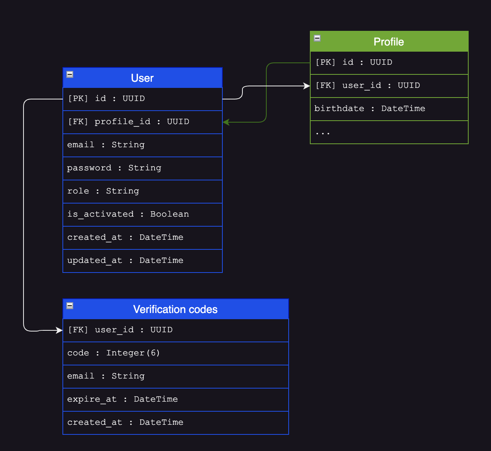
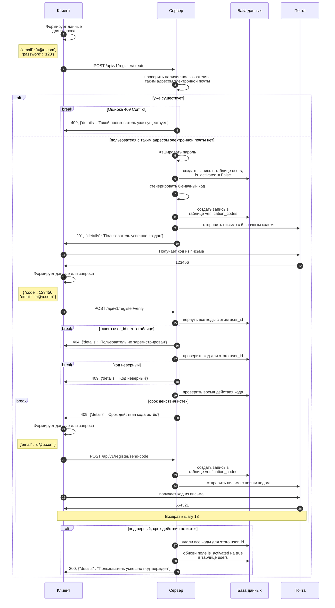

# Регистрация пользователя
Создание нового пользователя в системе.

## Проектирование
### Модели базы данных

Сценарий регистрации включает в себя следующие сущности и связи:

* users
    - `[PrimaryKey]` `id`:`UUID` - первичный ключ, идентификатор пользователя в таблице.
    - `[ForeignKey]` `profile_id`:`UUID` - внешний ключ, ссылка на таблицу `Profile` идентификатор профиля пользователя. Связь `один-к-одному`.
    - `email`:`String` - адрес электронной почты пользователя.
    - `password`:`String` - хэшированный пароль пользователя.
    - `role`:`String` - по умолчанию `"guest"`. Роль пользователя в системе. Обычная строка, может иметь значение: `"admin"`, `"user"`, `"guest"`, `"moderator"`.
    - `is_activated`:`Boolean` - по умолчанию `false`.
        - `true` - пользователь подтвердил почту
        - `false` - не подтвердил. 
    - `created_at`:`Datetime` - дата и время добавления пользователя в таблицу.
    - `updated_at`:`Datetime` - дата и время обновления пользователя в таблице.

* verification_codes
    - `[ForeignKey]` `user_id`:`UUID` - внешний ключ, ссылка на таблицу `users` идентификатор пользователя. Связь `один-ко-многим`.
    - `code`:`Integer` - сгенерированный 6-значный код подтверждения. Максимум 6 цифр.
    - `email`:`String` - электронный адрес почты, на который был отправлен код подтверждения.
    - `expire_at`:`Datetime` - дата и время истечения кода подтверждения.
    - `created_at`:`Datetime` - дата и время добавления кода в таблицу.

Сущность `Profile` в этом сценарии не используется.

### Эндпоинты

Сценарий регистрации включает в себя следующие шаги:

- Основной:
    1. ``POST /api/v1/register/create`` - 
    создание записи в таблице пользователей в базе данных.
    2. ``POST /api/v1/register/verify`` - 
    обновление статуса пользователя с "Неподтвержден" на "Подтвержден".

- Вспомогательный:
    На случай, если пользователь уже создан в базе данных, однако не прошел
    верификацию, то ему необходимо выслать новый код и завершить флоу регистрации.
    1. ``POST /api/v1/register/send-code`` - отправить новый код для подтверждения.
    2. ``POST /api/v1/register/verify`` - обновить статус пользователя с "Неподтвержден" на "Подтвержден".

### Описание

Для регистрации нового пользователя клиенту необходимо сформировать запрос с учетными данными:

* ``email`` - адрес электронной почты;
* ``password`` - пароль;

После чего отправить запрос на ``/api/v1/register/create``. Приложение на сервере проверит учетные данные на
уникальность:

* если пользователь с таким адресом электронной почты уже существует - сервер вернет ответ с сообщением об ошибке:
``409 Conflit``, ``{"details" : "Такой пользователь уже существует"}``
* если пользователя с таким адресом электронной почты в базе данных нет, тогда сервер:
    * хэширует пароль
    * создаст новую запись в таблице пользователей
    * сгенерирует 6-значный код
    * сохранит его в базе данных
    * отправит 6-значный код для верификации на эту электронную почту
    * вернет ответ с сообщением об успешной регистрации: ``201 Created``, ``{"details" : "Пользователь успешно создан"}``.

Далее пользователю необходимо извлечь 6-значный код из электронного письма и ввести его в форму регистрации. Клиентскому приложению необходимо сформировать запрос с данными:

* ``code`` - код для верификаци из письма;
* ``email`` - адрес электронной почты;

После чего отправить запрос на ``/api/v1/register/verify``. Приложение на сервере проверит код:

* если код верификации не верен - сервер вернет ответ с сообщением об ошибке: ``401 Unauthorized``, ``{"details" : "Код неверный"}``
* если код верификации истёк - сервер вернет ответ с сообщением об ошибке: ``401 Unauthorized``, ``{"details" : "Время действия проверочного кода истекло"}``
* если код верификации верен и время его действия не истекло - сервер обновит поле ``is_activated`` на значение ``true`` в таблице пользователей, и вернет ответ с сообщением об успешной регистрации: ``200 Created``, ``{"details" : "Пользователь успешно подтвержден"}``.

### Схема

## Реализация
`` здесь будут всякие диаграммы со сниппетами кода``